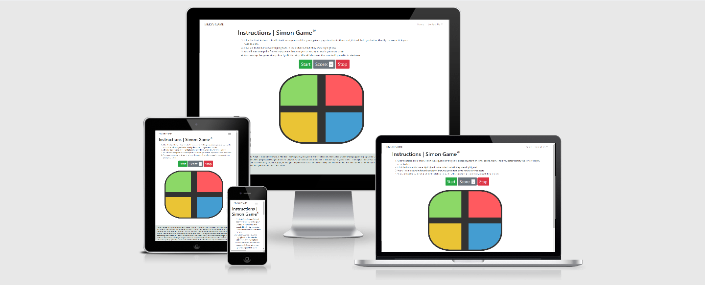
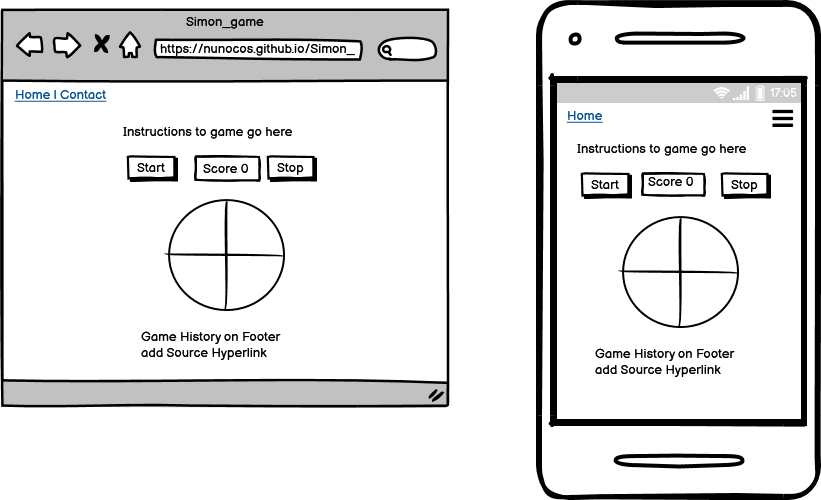

# Simon Game

Hello and welcome to my second milestone project. For this project I chose to create my version of the simon game, as I like the attention to detail and love the challenge I think that this would be the right selection for me.
The Simon Game is a memory game and was invented by Ralph H. Baer and Howard J. Morrison in 1978.
The project is developed using HTML, CSS and JavaScript.

[**View Simon Game website here!**](https://nunocos.github.io/Simon-game-milestone/)

---

## Description

Simon plays a random sequence for the player to repeat using colours and sounds. The player has to repeat the same sequence as Simon to win the game, this sequence will get longer and longer if the player gets the right sequence, if he gets it wrong the sequence will be repeated and the player can continue the game.

---

## UX and Features

As the game as a colorfoul layout that's exactly how the layout should seem, will have a different background to enhance the target area.

##### User Stories
* I want a game that is clear on how to play.
* I want to know if I got the sequence right.
* I want to start over the game if I want to.
* I want to know when I win the game and not an infinite game.

#### Strategy
The aim of this project is to create interactivity between the user and the game.

#### Goals
The goal of this website is to give a good experience to the user and to the user to have fun with this interactive game.

#### Scope
The website is designed to be responsive so that users can also interact with it on mobile.

---

#### Features

* Navbar
    * Basic Navbar, navbar taken from the previous milestone project and adapted to this project. Only has 2 list items on this case, the homepage and contact from

* Homepage
    * On the homepage there will be displayed only the game and instructions.

* Instructions
    * Clear instructions added, user just needs to follow the directions.

* Simon Game
    * Start button so that the user can initiate the game;
    * Score box with counter so that the user can see the current score.
    * Stop button so that the user can stop the game or start from scratch.
    * I opted not to include the Strict mode as some user enquired said that is fairly annoying to every time they got one tile wrong to start over.
    * 2 Alert boxes added to javascript code (when user gets sequence incorrect and when user wins the game) also sound added for when user gets sequence correct and when user wins the game a clapping sound plays.

* Contact Form Page
    * Basic Bootstrap contact form with Email API to forward the contact from the users to me.

---

#### Skeleton

* Wireframe was created using [Balsamiq](https://balsamiq.com/)

##### Home Page

---

## Changes
Removed contact us page and added social media links to navbar.
Removed on/off switch and only added start/stop button easier to understand

## Technologies Used

##### Languages Used

* [HTML5](https://en.wikipedia.org/wiki/HTML5)
* [CSS3](https://en.wikipedia.org/wiki/CSS)
* [JavaScript](https://en.wikipedia.org/wiki/JavaScript)

##### Frameworks, Libraries & Programs Used

* [Git](https://git-scm.com/)
* [Bootsrap](https://getbootstrap.com/)
* [GitHub](https://github.com/)
* [Balsamiq](https://balsamiq.com/)
* [Google Fonts](https://fonts.google.com/)
* [Coolors](https://coolors.co/ebf5df-bad4aa-d4d4aa-edb458-e8871e)
* [Chrome DevTools](https://developers.google.com/web/tools/chrome-devtools)
* [Autoprefixer CSS](https://autoprefixer.github.io/)
* [JQuery](https://jquery.com/)

---

##### Validation

[W3C Markup Validator](https://validator.w3.org/)
* Index page - no errors, just a warning - PASS
* Contact-us page - no errors, just warnings - PASS

[W3C CSS Validator](https://jigsaw.w3.org/css-validator/)
* no errors found, all PASS

[JS Hint](https://jshint.com/)
    *No errors found, just one warning.

[Google's Mobile-Friendly Test](https://search.google.com/test/mobile-friendly)
* Page is mobile responsive

##### Testing

Used the above validators to check the code but tested the following:
1. Clicked start and stop buttons to check if correct action is being done,
2. Checked if score was incremented correctly,
3. Checked on Devtools console tab if the game sequence and user sequence were being displayed correctly,
4. Checked on Devtools console tab if correct IDs were being invocked,
5. Played full game to ensure alert text box shows at the end of the game and winner sound is played,
6. Missed sequence to check alert text box shows incorrect message and sequence is repeated, validated on Devtools Console checking the original sequence,
7. Pressed multiple times the start button to ensure that button is turned off after it is pressed.
8. Tested navbar buttons, all directing to correct Pages

##### Bugs/errors
1. I had to start over the javascript code multiple times due to errors on javascript code with sequence not highlighting and stop button not working.
2. Based on other users the start and Stop buttons are too small on mobile, adjusted size of the font to 30px
3. Keys pressed not highlighting, this issue only happens on mobile, website optimized for desktop use.
4. Game pad was closer to right side, adjusted padding so that game pad is centered
5. When screen resolution is bellow 400px game is cut off, reduced game area size and issue is no longer visible
7. On Iphone there is a delay on highlight and sound when playing the game. This was sorted by adding the audio files in the header of html instead of the end.

## Deployment

##### GitHub Pages

1. A local project was created in GitHub with a new repository called 'Mind-Gym-Project'
2. The project had regular push and detailed commits which were pushed to the GitHub website before deployment
3. The project was deployed by logging in to GitHub and locating the [GitHub Repository](https://nunocos.github.io/Simon-game-milestone/)
4. At the top of the Repository (not top of page), locate the "Settings" Button on the menu and click
5. Scroll down the Settings page until the "GitHub Pages" Section was found
6. Under "Source", click the dropdown called "None" and select "Master Branch"
7. The page will refresh and you will be brought back to the top of the settings page
8. Scroll back down through the page to locate the now published site [link](https://nunocos.github.io/Simon-game-milestone/) in the "GitHub Pages" section
9. The code can be run locally through clone or download, you can do this by opening the repository, clicking on the code button and then selecting either 'clone' or 'download'
10. The Clone option provides a url, which you can use on your desktop IDE
11. The Download option gives you a link so that you can download the zip file so that you can unzip it in your local machine
---

## Credits

I used several code from other users:

##### Code Snippets

* [Highlight sequence](https://stackoverflow.com/a/36707123/9179340)
* [How to compare arrays](https://stackoverflow.com/questions/7837456/how-to-compare-arrays-in-javascript#19746771) from Stack Overflow
* [Happy Coder](https://www.youtube.com/watch?v=4pfvy_A5ceE) The code for playing sounds is from this video by YouTube user Happy Coder , I had a error when the load was invocked but this was due to sound id being displayed incorrectly, corrected id name and load function is working.
* [Soundjay](https://www.soundjay.com/index.html) for all sounds on the game
* [Freshman](https://freshman.tech/simon-game/) Tutorial for beginners on how to build a Simon game with JS
* [George Lewis](https://www.youtube.com/watch?v=zwKoo7VDj44) - Ideas on how to write out my HTML for the Simon game
* [George Lewis](https://www.youtube.com/watch?v=muPIIfjazcU) - Ideas on how to write out my CSS for the Simon game
* [WebDev Junkie](https://www.youtube.com/watch?v=W0MxUHlZo6U&ab_channel=WebDevJunkie) - Basic Simon game development
* [Code Review](https://codereview.stackexchange.com/questions/162096/simon-game-in-javascript) - JavaScript section developed based on example and adapted to my own, took in consideration the comments from other developers.

* [Code Institute](https://codeinstitute.net/)
    * Used code for Navbar and adjusted to my project
---

## Acknowledgements
I would like to thank my mentor, **Spencer Barriball**, for his help on this project and for providing me some tools that made my project easier,
**Slack Community** for their assistance with minor coding issues and **Rafael Assugeni** who tested my page and gave me excellent feedback based on his milestone submission.
